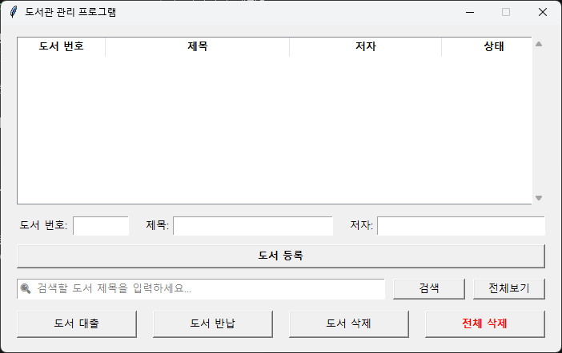
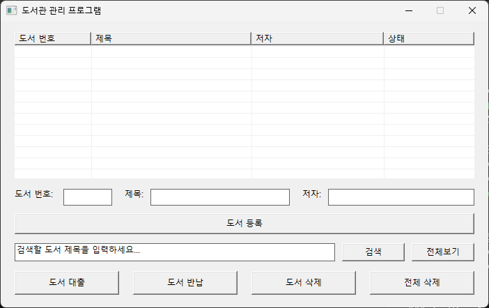

# 바이브 코딩 연습
## 계산기, 도서 관리 시스템 제작

## 📚 도서관 관리 프로그램 (Library Management System)

파이썬(Python)과 C++(Win32 API) 두 가지 버전으로 구현해 보며 발전시킨 도서관 관리 프로그램 프로젝트입니다.
도서 등록, 검색, 대출, 반납, 파일 입출력 및 GUI 환경 최적화 과정을 담고 있습니다.

<figure align="center">
  
  <figcaption><b>파이썬(Python) 버전</b></figcaption>
</figure>

 

<figure align="center">
  
  <figcaption><b>C++(Win32 API) 버전</b></figcaption>
</figure>

---

## 🛠️ 개발 과정 및 주요 트러블슈팅 (Troubleshooting)

프로젝트를 진행하며 마주쳤던 주요 문제들과 이를 해결한 과정의 기록입니다.

### 1. C++ 콘솔 환경의 한계와 GUI 전환
* **문제 상황:** 초기 콘솔(CLI) 환경에서 파이썬의 `tkinter`처럼 입력창 내부에 은은한 안내 문구(플레이스홀더)를 띄우고 싶었으나, 콘솔은 텍스트가 순차적으로 출력되는 구조라 구현이 불가능했습니다.
* **해결 방법:** C++ 콘솔에서는 입력을 받기 전 `cout`으로 안내 문구를 출력하는 방식으로 사용자 경험(UX)을 보완했고, 최종적으로는 본격적인 **C++ Win32 API GUI 애플리케이션**으로 발전시켰습니다.

### 2. C++ Win32 API 레이아웃 및 여백 최적화
* **문제 상황:** 창 크기를 고정하고 컨트롤을 배치할 때, Windows 타이틀바 및 테두리(Non-client area) 영역 때문에 내부 컨트롤들의 좌표가 밀리며 하단 공백이 어색해지는 현상이 발생했습니다.
* **해결 방법:** 
  * `AdjustWindowRect` 함수를 사용하여 원하는 내부 클라이언트 영역 크기에 맞춰 창 전체 크기를 정밀하게 계산하도록 수정했습니다.
  * 리스트뷰와 입력 폼, 하단 버튼들의 `y` 좌표를 재조정하여 여백 없이 깔끔한 비율을 맞췄습니다.

### 3. C++ 검색창 플레이스홀더(Placeholder) 구현
* **문제 상황:** Windows 표준 에디트(`EDIT`) 컨트롤은 기본적으로 HTML5나 최신 프레임워크처럼 회색 안내 텍스트(플레이스홀더) 기능을 기본 제공하지 않습니다.
* **해결 방법:** 
  * `WM_COMMAND` 메시지에서 `EN_SETFOCUS`(포커스 획득)와 `EN_KILLFOCUS`(포커스 상실) 이벤트를 감지하여 제어했습니다.
  * 사용자가 검색창을 클릭하면 안내 문구를 지워주고, 입력 없이 포커스가 벗어나면 다시 안내 문구를 채워 넣는 방식으로 플레이스홀더 기능을 구현했습니다.

### 4. 입력 필드 데이터 누락 및 문자열 처리 오류 수정
* **문제 상황:** 도서 등록 시 제목(`title`)이나 저자(`author`) 입력창에 적은 값이 제대로 읽히지 않거나, 엉뚱한 변수로 데이터가 매핑되어 리스트뷰나 파일(`library.txt`)에 공백이나 깨진 데이터가 들어가는 문제가 발생했습니다.
* **해결 방법:** 
  * `GetWindowTextW`를 사용할 때 버퍼 크기를 넉넉하게 잡지 않았거나, 유니코드(`wchar_t`) 문자열 배열과 `wstring` 간의 변환 과정에서 인덱스 및 길이 지정을 잘못했던 부분을 바로잡았습니다.
  * 입력받는 각 에디트 컨트롤 핸들(`hEditId`, `hEditTitle`, `hEditAuthor`)의 파라미터 매핑을 정확히 분리하여 데이터가 누락 없이 안전하게 담기도록 수정했습니다.

### 5. 컴파일 경고(Warning) 메시지 제거 및 코드 정제
* **문제 상황:** 컴파일은 성공하지만 자료형 불일치(예: `int`와 `size_t` 비교, 안전하지 않은 문자열 함수 사용 등)로 인해 수많은 컴파일 경고 메시지가 발생했습니다.
* **해결 방법:** 
  * 문자열 복사 함수를 안전한 `swprintf_s`로 변경하고, 루프문에서 인덱스를 비교할 때 발생하던 `size_t`와 `int` 간의 부호 있는/없는 비교 경고를 명시적 형변환(`(int)`, `(size_t)`)을 통해 깔끔하게 해결했습니다.

### 6. Visual Studio 빌드 시 `main` 함수 누락 에러 (LNK2019)
* **문제 상황:** Visual Studio에서 **Release** 모드로 변경 후 빌드했을 때 `main` 함수를 찾지 못한다는 링커 에러가 발생했습니다.
* **해결 방법:** 
  * 프로젝트가 Windows GUI 앱으로 설정되어 있어 컴파일러가 `main` 대신 `WinMain`을 찾도록 설정해야 했습니다.
  * **[프로젝트 속성] -> [링커] -> [시스템]**에서 **하위 시스템(Subsystem)**을 **`Windows (/SUBSYSTEM:WINDOWS)`**로 명시하여 해결했습니다.

### 7. 빌드 부산물(`pdb` 파일)에 대한 이해
* **궁금증:** Release 빌드 시 생성되는 `.pdb` 파일이 없으면 `.exe` 파일이 작동하지 않는지 의문이 생겼습니다.
* **확인 결과:** `.pdb` 파일은 디버깅용 정보(변수/함수 이름, 줄 번호 등)를 담고 있는 파일이므로, 최종 실행 시에는 **`.exe` 파일만 단독으로 배포해도 아무 문제 없이 완벽하게 작동**합니다.

---

## 🚀 기술 스택 (Tech Stack)
* **Language:** C++ (Win32 API) / Python
* **IDE / Tool:** Visual Studio, VS Code
* **Data Storage:** Local Text File (`library.txt`)
