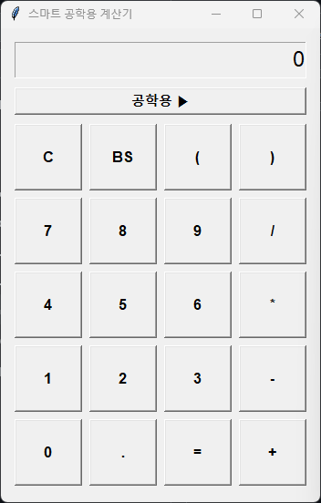
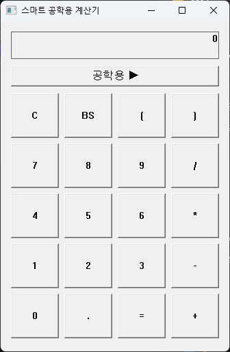

# 바이브 코딩 연습
## 계산기, 도서 관리 시스템 제작

---

## 📌 목차 (Table of Contents)
* [1. 스마트 공학용 계산기](#calculator)
  * [계산기 개발 과정 및 트러블슈팅](#calc-trouble)
* [2. 도서관 관리 프로그램](#lms)
  * [도서관 관리 프로그램 개발 과정 및 트러블슈팅](#lms-trouble)
* [3. 기술 스택](#tech)

---

## 🧮 스마트 공학용 계산기 (Smart Engineering Calculator)

파이썬(`tkinter` 및 `math`)을 활용하여 제작한 GUI 기반의 공학용 계산기 프로젝트입니다. 일반용 모드와 공학용 모드 간의 유연한 화면 전환, 직관적인 버튼 레이아웃, 그리고 고급 수식 전처리 기능을 담고 있습니다.

  <table border="0" cellpadding="0" cellspacing="0" style="border-collapse: collapse; border: none; margin: 0 auto;">
    <tr>
      <td align="center" style="border: none; padding: 0 15px; vertical-align: top;">
        
<b>파이썬(Python) 버전</b>

        
      </td>
      <td align="center" style="border: none; padding: 0 15px; vertical-align: top;">
        
<b>C++(Win32 API) 버전</b>

        
      </td>
    </tr>
  </table>

---

### 🛠️ 계산기 개발 과정 및 주요 트러블슈팅 (Troubleshooting)

계산기를 구현하며 단계별로 확장해 나간 주요 기능과 해결 과정의 기록입니다.

* **백스페이스(Backspace) 및 초기화(`C`) 기능 구현**
  * **문제 상황:** 수식 중 마지막 글자만 지우는 기능과 화면을 초기 상태(`0`)로 돌리는 리셋 기능이 필요했습니다.
  * **해결 방법:** `on_backspace` 메서드로 수식의 마지막 문자열을 잘라내도록 처리(`current[:-1]`)했으며, 에러 상태일 때는 안전하게 `0`으로 리셋되도록 설계했습니다.

* **괄호(`(`, `)`) 및 상단 레이아웃 정돈**
  * **문제 상황:** 수식 우선순위 제어를 위한 괄호 입력이 필요했고, 주요 제어 버튼들을 상단에 깔끔하게 배치하고 싶었습니다.
  * **해결 방법:** 괄호 버튼을 기본 패널에 추가하고, 연산 화면 및 토글 버튼 밑에 균형 잡힌 간격으로 위젯 배치를 재조정했습니다.

* **암묵적 곱셈(Implicit Multiplication) 자동 처리**
  * **문제 상황:** `2(3+4)`나 `12π`처럼 곱셈 기호(`*`)를 생략하고 입력했을 때 수식 오류가 발생하는 문제가 있었습니다.
  * **해결 방법:** `preprocess_expression` 전처리 로직을 도입하여 숫자와 괄호, 파이(`π`) 사이에 곱셈 연산자(`*`)를 자동으로 주입하도록 구현했습니다.

* **파이(`π`) 기호의 미관 개선 및 치환**
  * **문제 상황:** 파이 입력 시 긴 소수점(`3.141592...`)이 그대로 노출되어 UI가 지저분해지는 문제가 있었습니다.
  * **해결 방법:** 화면에는 직관적인 `π` 문자로 예쁘게 출력되도록 유지하고, 실제 계산(`eval`) 직전 단계에서 파이썬의 `math.pi` 값으로 자동 치환되도록 분리했습니다.

* **결과값 연산 체이닝(`=`) 및 입력 상태 제어**
  * **문제 상황:** `=`를 눌러 결과가 나온 직후 연산을 이어나갈 때와 새로운 숫자를 누를 때의 입력 규칙을 정립해야 했습니다.
  * **해결 방법:** `clear_on_next_input` 플래그를 두어, 연산자를 누르면 결과값에 이어서 수식이 확장되고, 숫자를 누르면 새로운 입력으로 전환되도록 제어했습니다.

* **공학용 모드 토글(Toggle) 및 동적 레이아웃 구성**
  * **문제 상황:** 일반용과 공학용 화면을 하나의 창에서 버튼 클릭 하나로 확장/축소할 수 있어야 했습니다.
  * **해결 방법:** `toggle_mode`로 창의 가로 폭을 동적으로 변경하고, 일반용 버튼 20개와 공학용 확장 버튼들이 비율에 맞게 재배치되도록 구현했습니다.

---

## 📚 도서관 관리 프로그램 (Library Management System)

파이썬(Python)과 C++(Win32 API) 두 가지 버전으로 구현해 보며 발전시킨 도서관 관리 프로그램 프로젝트입니다.
도서 등록, 검색, 대출, 반납, 파일 입출력 및 GUI 환경 최적화 과정을 담고 있습니다.

  <h3>파이썬(Python) 버전</h3>
  

  

  <h3>C++(Win32 API) 버전</h3>
  

---

### 🛠️ 도서관 관리 프로그램 개발 과정 및 주요 트러블슈팅 (Troubleshooting)

프로젝트를 진행하며 마주쳤던 주요 문제들과 이를 해결한 과정의 기록입니다.

* **C++ 콘솔 환경의 한계와 GUI 전환**
  * **문제 상황:** 초기 콘솔(CLI) 환경에서 안내 문구(플레이스홀더) 구현의 한계를 마주했습니다.
  * **해결 방법:** 최종적으로 본격적인 **C++ Win32 API GUI 애플리케이션**으로 발전시켜 사용자 경험을 개선했습니다.

* **C++ Win32 API 레이아웃 및 여백 최적화**
  * **문제 상황:** Windows 타이틀바 및 테두리 영역 때문에 컨트롤 좌표가 밀리며 하단 공백이 어색해지는 현상이 발생했습니다.
  * **해결 방법:** `AdjustWindowRect` 함수와 세부 좌표 재조정을 통해 여백 없이 깔끔한 비율을 맞췄습니다.

* **C++ 검색창 플레이스홀더(Placeholder) 구현**
  * **문제 상황:** Windows 표준 에디트(`EDIT`) 컨트롤이 기본적으로 회색 안내 텍스트 기능을 제공하지 않았습니다.
  * **해결 방법:** `WM_COMMAND` 메시지에서 `EN_SETFOCUS`와 `EN_KILLFOCUS` 이벤트를 감지하여 플레이스홀더 기능을 구현했습니다.

* **입력 필드 데이터 누락 및 문자열 처리 오류 수정**
  * **문제 상황:** 도서 등록 시 입력창의 값이 제대로 읽히지 않거나 엉뚱한 변수로 데이터가 매핑되는 문제가 발생했습니다.
  * **해결 방법:** `GetWindowTextW` 사용 시 버퍼 크기 및 유니코드(`wchar_t`) 변환 오류를 바로잡고 에디트 컨트롤 핸들 매핑을 정확히 분리했습니다.

* **컴파일 경고(Warning) 메시지 제거 및 코드 정제**
  * **문제 상황:** 자료형 불일치 및 안전하지 않은 문자열 함수 사용 등으로 수많은 컴파일 경고가 발생했습니다.
  * **해결 방법:** 안전한 함수(`swprintf_s`) 변경과 명시적 형변환을 통해 경고들을 깔끔하게 정리했습니다.

* **Visual Studio 빌드 시 `main` 함수 누락 에러 (LNK2019)**
  * **문제 상황:** Release 모드 변경 후 빌드 시 `main` 함수를 찾지 못하는 링커 에러가 발생했습니다.
  * **해결 방법:** 프로젝트 속성 [링커] -> [시스템]에서 하위 시스템을 `Windows (/SUBSYSTEM:WINDOWS)`로 명시하여 해결했습니다.

* **빌드 부산물(`pdb` 파일)에 대한 이해**
  * **궁금증:** Release 빌드 시 생성되는 `.pdb` 파일이 없으면 `.exe` 파일이 작동하지 않는지 의문이 생겼습니다.
  * **확인 결과:** 디버깅용 파일이므로 최종 실행 시에는 **`.exe` 파일만 단독으로 배포해도 완벽하게 작동**함을 확인했습니다.

---

## 🚀 기술 스택 (Tech Stack)
* **Language:** C++ (Win32 API) / Python
* **IDE / Tool:** Visual Studio, VS Code
* **Data Storage:** Local Text File (`library.txt`)
